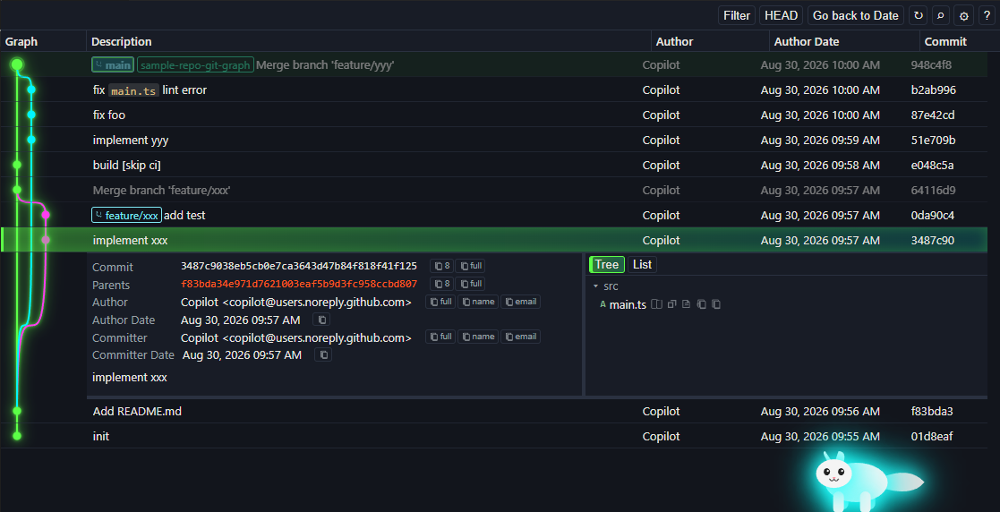

# Git Graph Ray

[English](README.md) | [日本語](README.ja.md)

View a Git graph of your repository and run Git actions from it.

Open the graph from the Command Palette (**Git Graph Ray: View Git Graph**), the SCM title bar, or the status bar. Commits, branches, tags, remotes, stashes, and worktrees are shown together so you can inspect history and act on it without leaving the editor.

## Features

- **Commit graph** — Color-coded branches, merges, and refs in a virtualized table (description, author, dates, hash).
- **Commit details** — Metadata, parents, and file changes in Tree or List view. Open diffs and revisions from the graph.
- **Git actions** — Branch, merge, rebase, cherry-pick, revert, reset, tag, stash, pull/push, and worktree operations from the graph.
- **Repositories and worktrees** — Discover nested repos, add or hide folders, and treat worktrees as first-class repos.
- **Filtering and navigation** — Multi-select branches/remotes/tags, jump to HEAD, search, mute merge commits, and load more history as you scroll.
- **Themes** — Graph themes including Classic, Ray, Ray Wave, and Ray Cycle.

## Requirements

- Visual Studio Code 1.128 or later
- Git available on your PATH

## Commands

| Command | Description |
| --- | --- |
| **Git Graph Ray: View Git Graph** | Open the graph for the current workspace |
| **Git Graph Ray: Fetch from Remote(s)** | Fetch remotes and open the graph |
| **Git Graph Ray: Add Git Repository...** | Add a repository that was not discovered automatically |
| **Git Graph Ray: Remove Git Repository...** | Hide a repository from the graph |

## License

[MIT](https://github.com/nohi/git-graph-ray)
